<!-- Custom animated header — no external dependencies -->


<p align="center">
  <a href="https://zach-abraham.github.io/clawd-hq"></a>
  <a href="https://linkedin.com/in/zachabraham1"></a>
  <a href="mailto:zrabraham@gmail.com"></a>
</p>

---

<!-- Bento grid: 2-column layout -->
<table>
<tr>
<td width="55%" valign="top">

### What I Build

I build **multi-agent AI systems** that run themselves. Eight specialized agents coordinate through a shared event bus and persistent memory layer — handling everything from prediction markets to job applications to infrastructure monitoring.

**The system is live.** Right now, on a Mac Mini in Houston, agents are trading Kalshi contracts, applying to jobs, monitoring five machines, and synthesizing cross-domain insights every six hours.

> *Automate the boring. Synthesize the complex. Sleep through the night.*

</td>
<td width="45%" valign="top">

### System at a Glance

```
┌─────────────────────────────┐
│ 🔴 HAL Orchestrator         │
├─────────────────────────────┤
│ 8 autonomous agents         │
│ 5-machine Tailscale mesh    │
│ SQLite event bus (pub/sub)  │
│ Mem0 persistent memory      │
│ 6-hour synthesis heartbeat  │
│ Telegram alert pipeline     │
│ A2A cross-machine protocol  │
└─────────────────────────────┘
```

</td>
</tr>
</table>

---

### Clawd HQ — Multi-Agent Orchestration Platform

<table>
<tr>
<td>

[](https://github.com/zach-abraham/clawd-hq)
[](https://zach-abraham.github.io/clawd-hq)

8 AI agents on a Mac Mini. Each has its own domain, memory scope, Telegram topic, and schedule. They coordinate through a SQLite event bus and Mem0-powered memory layer.

| Agent | Domain | Schedule |
|-------|--------|----------|
| **HAL** | Orchestration | Always-on |
| **Trader** | Prediction Markets | Every 4h |
| **Recruiter** | Job Automation | Every 4h |
| **Banker** | Personal Finance | Daily |
| **Professor** | Education | On-demand |
| **CEO** | Strategy | On-demand |
| **Sentinel** | Infrastructure | Hourly |
| **Trainer** | Fitness | On-demand |

</td>
</tr>
</table>

<details>
<summary><b>Architecture Deep Dive</b></summary>
<br/>

<table>
<tr>
<td width="50%">

**Cross-Agent Event Bus**

SQLite-backed pub/sub with WAL mode. Event categories: `decision`, `alert`, `state_change`, `discovery`. Severity escalation routes critical events to Telegram. HAL consumes all events during synthesis.

</td>
<td width="50%">

**HAL Synthesis Heartbeat**

Every 6 hours, HAL queries all agent memories and events, passes them through Gemini Flash for cross-domain pattern detection, then posts insights to Telegram and stores them in persistent memory.

</td>
</tr>
<tr>
<td width="50%">

**Dual-Namespace Memory**

Mem0 Cloud with two namespaces: personal (cross-device agent memory) and shared (multi-user collaboration). DLP sanitization layer strips secrets before storage.

</td>
<td width="50%">

**Infrastructure Mesh**

5-machine Tailscale mesh. LaunchAgent-based scheduling. Docker services (Uptime Kuma, Langfuse, Beszel, n8n). A2A protocol for cross-machine agent communication.

</td>
</tr>
</table>

</details>

---

### Tech Stack

<p align="center">
  
</p>

<p align="center">
  
  
  
  
  
  
  
  
</p>

---

<details>
<summary><b>GitHub Stats</b></summary>
<br/>

<p align="center">
  
  
</p>

<p align="center">
  
</p>

</details>

---

<p align="center">
  <sub>Houston, TX · Built with Claude, Gemini, and way too much caffeine</sub>
</p>
