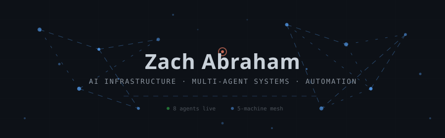

<!-- Custom animated header — no external dependencies -->


<p align="center">
  <a href="https://linkedin.com/in/zacharyrabraham"></a>
  <a href="mailto:zrabraham@gmail.com"></a>
  
</p>

---

<table>
<tr>
<td width="55%" valign="top">

### What I Build

I build **multi-agent AI systems that run themselves** — fleets of specialized agents that coordinate through a shared event bus and a persistent memory layer, with multi-provider LLM routing, self-healing automation, and cross-agent (A2A) communication.

**It's real infrastructure, not slideware.** Most of it runs 24/7 on a home server cluster: LLM routing with automatic failover, scheduled agents, health monitoring, and an evaluator loop that catches failures and repairs or escalates them without a human in the loop.

By day I'm an **IT systems & endpoint engineer** (Intune/MECM, M365, PowerShell/Python automation, multi-site server migrations). The systems below are where I push that further.

> *Automate the boring. Make it self-healing. Sleep through the night.*

</td>
<td width="45%" valign="top">

### System at a Glance

```
┌─────────────────────────────┐
│ HAL Orchestrator            │
├─────────────────────────────┤
│ Fleet of scoped agents      │
│ Event bus (pub/sub, WAL)    │
│ Persistent memory layer     │
│ 6-provider LLM failover     │
│ Self-healing scheduler      │
│ A2A cross-agent protocol    │
│ Telegram / CLI interface    │
└─────────────────────────────┘
```

</td>
</tr>
</table>

---

### Selected Work

[](https://github.com/zach-abraham/clawd-multi-agent)

A multi-agent system with domain-scoped agents, event-driven coordination, and a self-improving infrastructure layer. More flagship repos (multi-provider LLM orchestrator, A2A protocol server, persistent-memory stack) are being extracted from the live systems and published — clean, runnable, and secret-free.

<details>
<summary><b>Architecture Deep Dive</b></summary>
<br/>

<table>
<tr>
<td width="50%">

**Cross-Agent Event Bus**

SQLite-backed pub/sub with WAL mode. Event categories: `decision`, `alert`, `state_change`, `discovery`. Severity escalation routes critical events to a notification pipeline. The orchestrator consumes all events during synthesis.

</td>
<td width="50%">

**Synthesis Heartbeat**

On a schedule, the orchestrator queries every agent's memory and recent events, runs them through an LLM for cross-domain pattern detection, then surfaces insights and stores them in persistent memory.

</td>
</tr>
<tr>
<td width="50%">

**Multi-Provider LLM Routing**

Automatic failover and cost-aware fallback across six providers (Cerebras → Groq → NVIDIA NIM → SambaNova → local Ollama → Gemini), so a single rate-limit or outage never takes the system down.

</td>
<td width="50%">

**Persistent Memory + A2A**

A durable memory stack (PostgreSQL + Redis + Neo4j knowledge graph) gives agents long-term recall instead of stateless prompts. An Agent-to-Agent protocol server lets independent agents discover and delegate across machines.

</td>
</tr>
</table>

</details>

---

### Tech Stack

<p align="center">
  
</p>

<p align="center">
  
  
  
  
  
  
  
  
</p>

<p align="center">
  <sub>Open to <b>Systems / Infrastructure / Endpoint / Automation</b> engineering roles where IT ops meets real software.</sub>
</p>

---

<picture>
  
</picture>

---

<details>
<summary><b>GitHub Stats</b></summary>
<br/>

<p align="center">
  
  
</p>

<p align="center">
  
</p>

</details>

---

<p align="center">
  <sub>Houston, TX · AI infrastructure, multi-agent systems, automation</sub>
</p>
